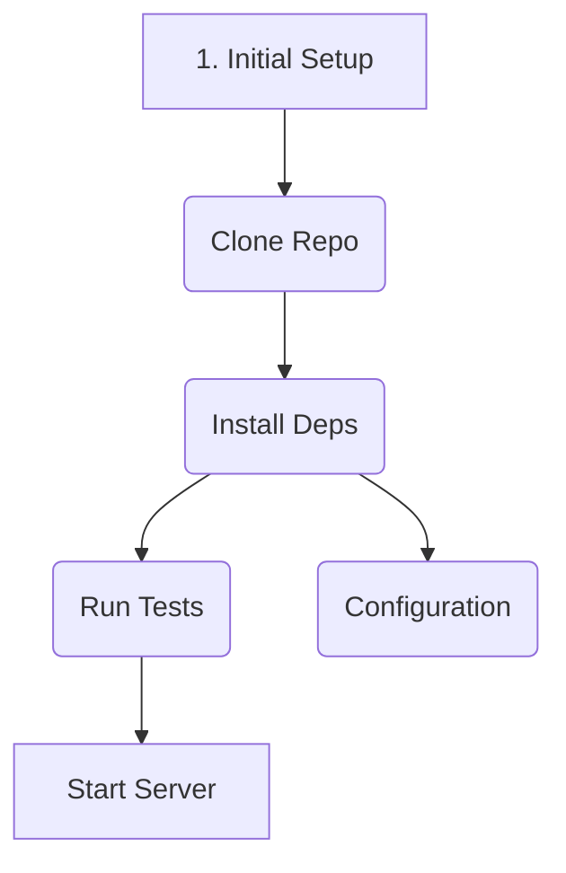

# 🚀 Project Name

A brief, compelling description of your project.

---

## ⚡ Workflow Circuit (Interactive Guide)

This visual path shows the flow of major documentation topics. Hover over the **bold labels** to see the topic summary, and click to navigate to the detailed guide.

---

## 📄 Documentation Links

If the visual flow isn't your thing, here are the direct links:

* **Setup:** [Initial Setup Guide](docs/setup.md)
* **Clone:** [Cloning the Repository](docs/clone.md)
* **Dependencies:** [Installation and Requirements](docs/dependencies.md)
* **Testing:** [Running All Project Tests](docs/testing.md)
* **Running:** [Starting the Application](docs/running.md)
* **Config:** [Advanced Configuration](docs/config.md)
